

  <h1>When Nanoseconds Matter: The CppCon 2024 Guide to Ultrafast Trading Systems in C++</h1>
  
An authoritative synthesis of David Gross's seminal CppCon 2024 presentation

 

## I. Introduction: The Imperative of Nanosecond Latency in Trading

In the fiercely competitive realm of modern financial markets, the pursuit of speed has become an unrelenting imperative. David Gross's presentation at CppCon 2024, "When Nanoseconds Matter: Ultrafast Trading Systems in C++," serves as a foundational text for understanding the engineering principles behind achieving nanosecond-level latency in high-frequency trading (HFT) environments. This document distills the core insights from his talk, offering a comprehensive guide for developers aiming to build and optimize such critical systems.

### Context: Ultrafast Trading and Market Making

Ultrafast trading systems operate at the extreme edges of technological capability, where every nanosecond can translate into significant financial advantage or loss. A key player in this ecosystem is the **Market Maker (MM)**, an entity that provides liquidity to the market by simultaneously quoting both buy (bid) and sell (ask) prices for financial instruments. This continuous quoting allows other market participants to execute trades instantly, without waiting for a matching order.

Gross characterizes market making as a "loser's game". This seemingly paradoxical statement, attributed to Charles D. Ellis, underscores a fundamental truth: success in market making is not about a single, groundbreaking strategy, but rather about **consistent excellence across all operational facets**. As Gross explains, "it's not about this one Silver Bullet that's going to allow you to beat the market; you need to be constantly good at everything". Market makers earn small profits on a high volume of trades, but they are constantly exposed to the risk of significant losses due to adverse market movements or stale pricing. The challenge lies in minimizing these potential losses by reacting instantaneously to new information and maintaining accurate prices.

  
  
<i>Figure 1: The continuous quoting process in market making.</i>

### The Dual Challenge: Speed and Accuracy

The necessity for low-latency programming in trading systems stems from two primary drivers:

1.  **Rapid Reaction to Events:** Financial markets are dynamic, constantly bombarded with news and events that can drastically alter asset prices. An ultrafast system must be able to ingest this new information, update its internal models, and adjust its quotes or cancel existing orders within nanoseconds to avoid trading on outdated information. Failure to do so can lead to significant losses, as other, faster participants will exploit these "stale prices".

2.  **Maintaining Accuracy:** Beyond mere speed, the system must also be **accurate**. Accuracy is intrinsically linked to latency; the faster a system can process and incorporate new information, the more accurate its pricing and decision-making will be. Good models are essential, but without the ability to ingest and react to information flow swiftly, even the most sophisticated models become ineffective. As Gross states, "you also need to be accurate and again accuracy is inly related to latency" [1] (PDF, p. 8).
  
  
<i>Figure 2: The dual requirements of speed and intelligence in trading systems.</i>

These two requirements necessitate a deep understanding of hardware, operating systems, and programming language intricacies, pushing the boundaries of conventional software engineering. The subsequent sections will delve into the specific techniques and principles advocated by David Gross to meet these extraordinary demands.

## II. The Modern Trading System Landscape: FPGA vs. Software

A common question in the HFT domain revolves around the role of Field-Programmable Gate Arrays (FPGAs). Given their inherent speed advantages, why does software, particularly low-latency C++, still matter? Gross provides a nuanced answer, highlighting the complementary nature of FPGAs and software in a modern trading system architecture.

### Why C++ and Software Optimization Remain Critical

FPGAs are undeniably fast, capable of executing operations at nanosecond speeds. They are often deployed at the very edge of the trading infrastructure, directly interfacing with exchanges to process market data and execute orders with minimal latency. However, their deployment is not without trade-offs.

  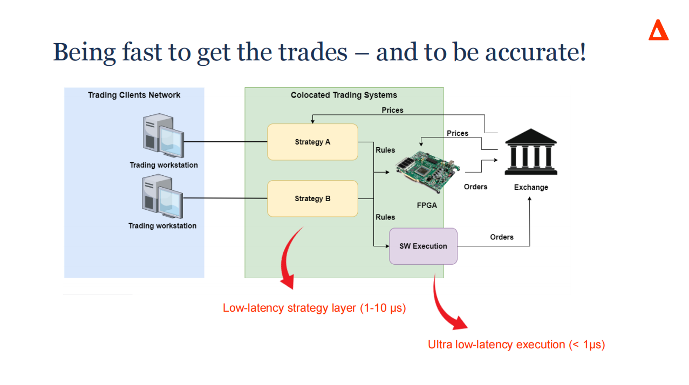
  
<i>Figure 3: A conceptual overview of a modern trading system, illustrating the interplay between software strategies and FPGA hardware.</i>

Gross identifies two key reasons why software, and thus C++ optimization, remains indispensable:

1.  **Cost-Benefit Analysis:** While the raw speed of an FPGA is compelling, the overall cost—encompassing not just the hardware itself, but also the significant engineering time required for development and the operational complexities of managing FPGA-based systems—is substantial. Software, in contrast, offers greater flexibility and a more favorable cost-benefit profile for many tasks.It allows for quicker iteration, easier debugging, and broader talent pools.

2.  **Strategic Complexity and Flexibility:** FPGAs achieve their blistering speed by being functionally simple. They excel at highly repetitive, deterministic tasks like bit comparison and data forwarding. As Gross puts it, an FPGA "sees bits, compares bits, sends bits". Introducing complex logic into an FPGA would inevitably slow it down, negating its primary advantage. This is where software strategies come into play. The "strategies" (represented by yellow boxes in Figure 3) are responsible for generating the complex trading rules that FPGAs then execute. These rules, such as "if price greater than 10, update my price or cancel my order," are dynamic and require sophisticated decision-making capabilities that are best handled by flexible software. Consequently, these software strategies themselves have stringent low-latency requirements, as stale rules would lead to trading on outdated information, just as stale prices would.

In essence, FPGAs and software work hand-in-hand. FPGAs provide the raw, unadulterated speed for simple, critical paths, while software offers the intelligence, adaptability, and cost-effectiveness needed for complex algorithmic decision-making. Optimizing C++ software is therefore not a relic of the past but a continuous necessity for maximizing the overall performance of these hybrid systems.

## III. Deep Dive into the Order Book Data Structure

Central to any trading system, whether algorithmic or manual, is the **Order Book**. This fundamental data structure aggregates all outstanding buy and sell orders for a particular financial instrument, providing a real-time snapshot of market depth and liquidity. Gross emphasizes its ubiquity, stating, "no matter you know like the trading system that you're working on could be algorithmic manual pretty much anything you always have this core component". He further reinforces this by quoting Larry Harris: "The order book is the heart of any trading system".

### Definition and Core Components

An order book is essentially a dynamic list of buy and sell orders, organized by price level. It consists of two main sides:

*   **Bids:** Orders from buyers indicating the maximum price they are willing to pay for an asset.
*   **Asks (or Offers):** Orders from sellers indicating the minimum price they are willing to accept for an asset.

  
  
<i>Figure 4: A simplified representation of an order book, showing bid and ask price levels with corresponding quantities.</i>

As illustrated in Figure 4, the **Best Bid** is the highest price a buyer is willing to pay, and the **Best Ask** is the lowest price a seller is willing to accept. The difference between the best ask and best bid is known as the **spread**. Each price level also shows the **quantity** (or volume) of shares or contracts available at that price. For instance, a best bid of $92 with a quantity of 50 means there are buyers willing to purchase a total of 50 units at $92.

### Initial Implementation with `std::map`

For a first attempt at implementing an order book in C++, `std::map` often comes to mind due to its inherent sorting capabilities. `std::map` is a container that stores elements in a sorted order based on their keys. This property is particularly useful for an order book, where price levels must be maintained in a specific sequence.

  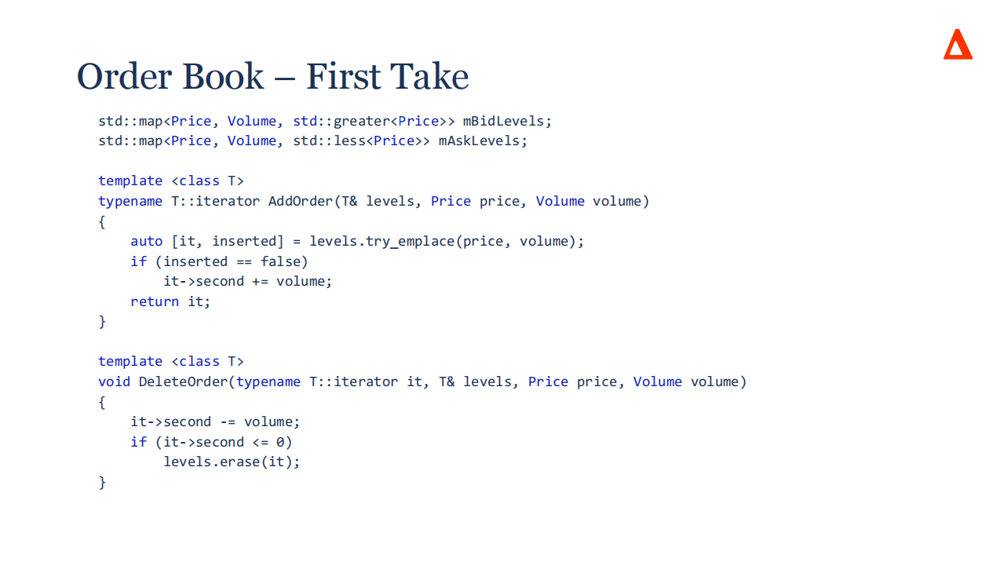
  
<i>Figure 5: An initial C++ implementation of an order book using `std::map`.</i>

#### Use of `std::greater` and `std::less` for Sorting

To maintain the correct order for bids and asks, `std::map` can be parameterized with custom comparators:

*   **Bids (`mBidLevels`):** For buy orders, higher prices are more advantageous. Therefore, `std::greater<double>` is used to sort bids in **descending order**, ensuring the best bid (highest price) is easily accessible at the beginning of the map.
*   **Asks (`mAskLevels`):** For sell orders, lower prices are more advantageous. `std::less<double>` is used to sort asks in **ascending order**, placing the best ask (lowest price) at the beginning of the map.
This setup allows for `O(1)` (constant time) access to the best bid and best ask, as they are always at `map.begin()`.

#### Explanation of `O(log N)` Complexity

Underneath, `std::map` is typically implemented as a **red-black tree**, a self-balancing binary search tree. This data structure guarantees logarithmic time complexity for insertion, deletion, and lookup operations (`O(log N)`). While `O(log N)` is generally considered efficient for many applications, in the context of nanosecond-level HFT, it can become a significant bottleneck.

### Challenges: NIC Buffers and Packet Loss

The theoretical efficiency of `std::map` quickly confronts the harsh realities of hardware limitations, particularly at the network interface card (NIC) level. The NIC is the physical gateway connecting trading servers to exchange networks, and its performance is paramount.

  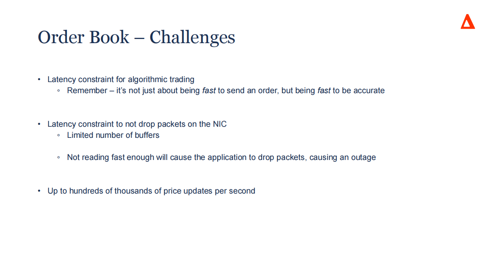
  
<i>Figure 6: Key challenges in order book processing, particularly related to network interface cards.</i>

Gross highlights several critical challenges related to NICs:

*   **Limited Buffers:** Like all physical devices, NICs have a finite amount of hardware buffer space (often referred to as ring buffers). In volatile market conditions, exchanges can disseminate hundreds of thousands of price updates per second. If these buffers fill up before the application can process the incoming data, new packets will be dropped.
*   **Packet Loss Leading to Outages:** For an order book, data integrity and sequence are non-negotiable. Dropped packets mean missing price updates, leading to a desynchronized internal order book state compared to the exchange. This discrepancy can trigger risk controls, halt trading, or result in substantial financial losses.
*   **Reading Speed Pressure:** The application software must read data from the NIC at an extremely high rate. If the CPU cannot keep pace with the incoming data stream, the NIC buffers will inevitably overflow. This underscores the need for not just fast processing, but also efficient data ingestion mechanisms.

These challenges emphasize that achieving low latency is not merely about algorithmic efficiency but also about a deep understanding of the underlying hardware and its constraints. The goal is to prevent data from ever accumulating at the NIC, ensuring the order book is updated in real-time with absolute accuracy. This sets the stage for exploring more hardware-aware data structures and optimization techniques.

## IV. Performance Bottlenecks and Optimizations: From `std::map` to `std::vector`

While `std::map` offers a convenient and logically sound approach for maintaining an ordered order book, its underlying implementation as a red-black tree introduces significant performance bottlenecks in the nanosecond-latency domain. The pursuit of true ultrafast performance necessitates a departure from such generic, node-based containers.

### The "First Take" - `std::map`'s Limitations

Despite its `O(log N)` algorithmic complexity for insertions, deletions, and lookups, `std::map` suffers from critical issues that severely impact real-world performance in HFT:

#### Cache Misses and Memory Fragmentation

`std::map` stores its elements as individual nodes, which are typically allocated dynamically and can be scattered across disparate memory locations. When the CPU attempts to access data from an `std::map`, it frequently encounters **cache misses**. A cache miss occurs when the requested data is not found in the CPU's fast cache memory, forcing the CPU to retrieve it from much slower main memory. This "jumping around" in memory to follow pointers between nodes is a primary performance killer. In contrast, contiguous data structures allow the CPU to load blocks of data into cache efficiently, leveraging **cache locality**.

#### The "Stable Iterator" Paradox

One perceived advantage of `std::map` is its **stable iterators**: inserting or deleting elements does not invalidate iterators to other elements. This allows for storing iterators (or pointers to nodes) in auxiliary data structures (like a `std::unordered_map` mapping order IDs to `std::map` iterators) to achieve `O(1)` average-case complexity for modifications and deletions. However, this benefit is overshadowed by the cache performance issues.

  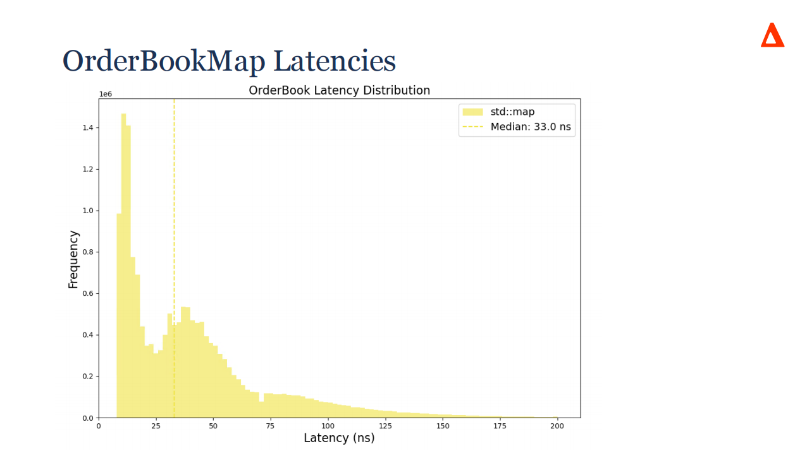
  
<i>Figure 7: Latency distribution for an `std::map`-based order book, showing a wide spread.</i>

Gross illustrates this with a compelling experiment. By intentionally introducing randomized memory allocations between operations (simulating memory fragmentation in a long-running system), the median latency of `std::map` operations can double (e.g., from 33ns to 63ns). This demonstrates that even if the algorithmic complexity is theoretically acceptable, the practical performance is highly susceptible to memory layout and cache behavior.

  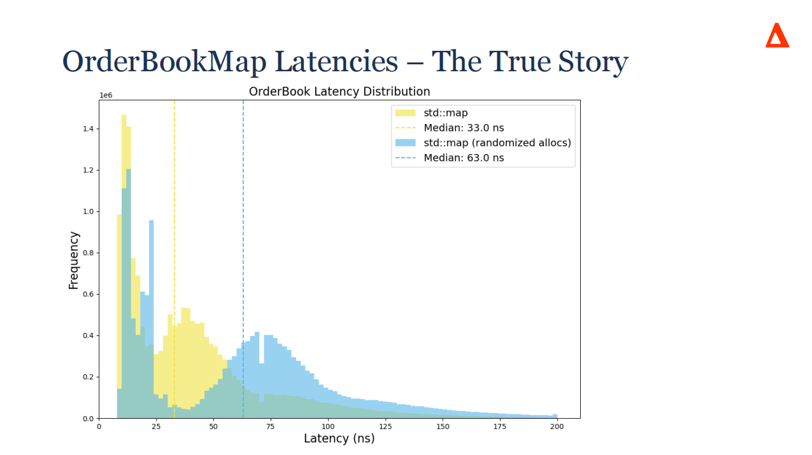
  
<i>Figure 8: The impact of memory fragmentation on `std::map` latency, revealing a significantly wider and slower distribution in a realistic scenario.</i>

### Transition to `std::vector` for Cache Locality

To overcome the limitations of node-based containers, the focus shifts to data structures that guarantee **contiguous memory allocation**. `std::vector` is the prime candidate, as it stores its elements in a single, contiguous block of memory. This property is crucial for maximizing cache hits and improving overall performance, even if it introduces other algorithmic complexities.

  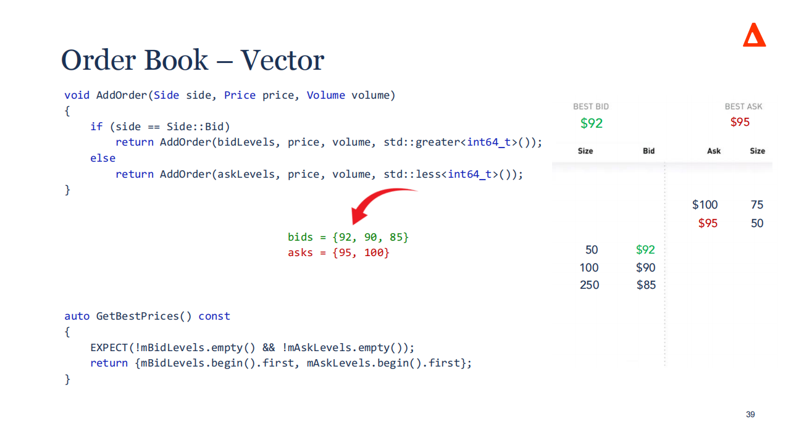
  
<i>Figure 9: A conceptual view of an order book implemented with `std::vector`.</i>

#### `std::lower_bound` for Ordered Insertion/Lookup

Since `std::vector` does not automatically maintain sorted order like `std::map`, manual sorting or ordered insertion is required. For an order book, where price levels must remain sorted, `std::lower_bound` becomes an essential tool. `std::lower_bound` performs a binary search on a sorted range, returning an iterator to the first element that is not less than (i.e., greater than or equal to) a specified value.This operation has a time complexity of `O(log N)`.

#### Complexity Analysis: `O(log N) + N` for Add/Delete

When using `std::vector` for an order book, the complexity of operations changes:

*   **AddOrder (Insert):** If a price level already exists, updating its quantity is `O(log N)` (for finding the element) plus `O(1)` (for modification). However, if a new price level needs to be inserted, `std::lower_bound` finds the insertion point in `O(log N)`, but the subsequent insertion into a `std::vector` requires shifting all subsequent elements, leading to an `O(N)` operation. Thus, adding a new price level becomes `O(log N) + O(N)`.
*   **ModifyOrder (Update):** Without stable iterators, `std::vector` requires a lookup (`O(log N)`) to find the element before modification. This is a regression from the `O(1)` achievable with `std::map` by storing iterators.
*   **DeleteOrder (Remove):** Similar to insertion, finding the element is `O(log N)`, but removing it from `std::vector` necessitates shifting subsequent elements, resulting in an `O(N)` operation.

  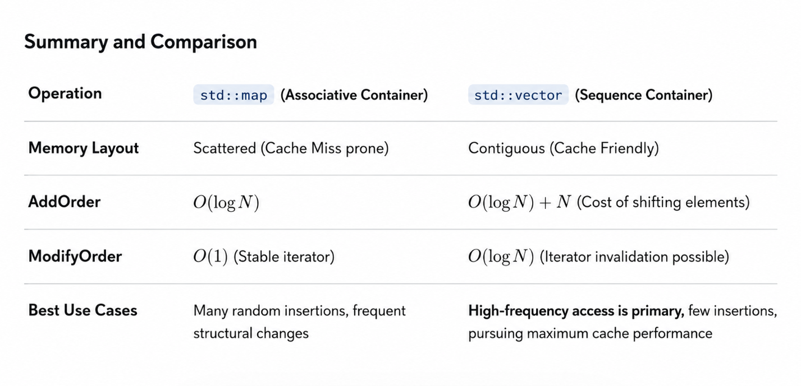
  
<i>Figure 10: A comparison of algorithmic complexities for `std::map` and `std::vector` operations.</i>

#### Trade-offs: Algorithmic Complexity vs. Hardware Awareness (Cache Hits)

At first glance, the `O(N)` complexity for insertions and deletions in `std::vector` might seem like a step backward compared to `std::map`'s `O(log N)`. However, this is where **hardware awareness** and **mechanical sympathy** come into play. For typical order book sizes (dozens to hundreds of price levels), the constant factor associated with `std::vector`'s contiguous memory access and superior cache performance often outweighs the theoretical logarithmic advantage of `std::map`'s scattered nodes. The CPU can process `std::vector` data much faster due to fewer cache misses, making it the preferred choice for raw speed.

  
  
<i>Figure 11: Latency distribution comparing `std::map` (light blue) and `std::vector` (green), showing `std::vector`'s improved performance but still exhibiting a "fat tail."</i>

### Optimizing `std::vector` for Order Book Dynamics

Even with `std::vector`, initial implementations might still exhibit a "fat tail" in their latency distribution (Figure 11), indicating occasional slow operations. This is often due to the nature of order book updates. Price updates are not uniformly distributed; they tend to concentrate around the best bid and ask prices. If the `std::vector` is ordered such that the best prices are at one end, frequent updates to these elements will cause continuous shifting of other elements, leading to `O(N)` copy operations.

  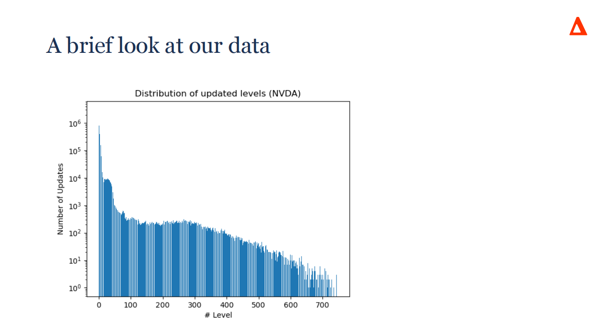
  
<i>Figure 12: An L-shaped distribution of price updates, indicating higher activity at the best bid/ask levels.</i>

#### Reversing the Vector for Minimal Data Movement

The solution, though counter-intuitive, is to **reverse the order of the vector** for one side of the order book. For example, if bids are typically sorted in descending order (highest price first), reversing it means the highest price is now at the end of the vector. This seemingly minor code change can drastically reduce data movement. By strategically placing the most frequently updated elements at the end (or beginning) where insertions/deletions are `O(1)`, the number of `O(N)` copy operations is minimized.

  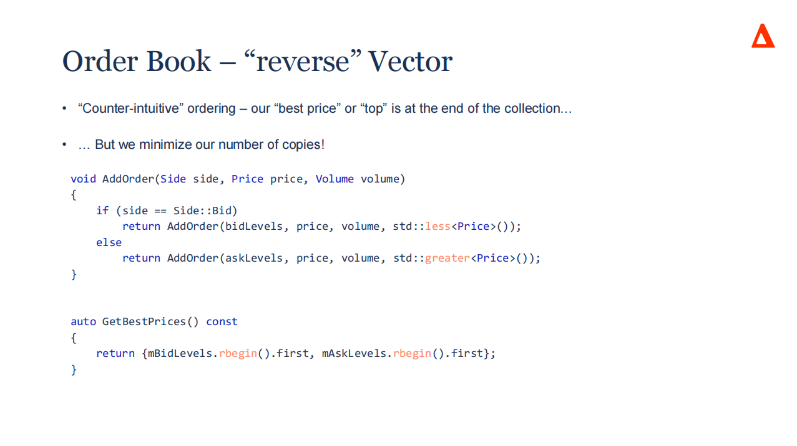
  
<i>Figure 13: Optimizing `std::vector` by reversing its order to minimize data movement during frequent updates.</i>

This optimization significantly narrows the latency distribution, effectively eliminating the "fat tail" and yielding a much more consistent and faster performance profile for the order book.

  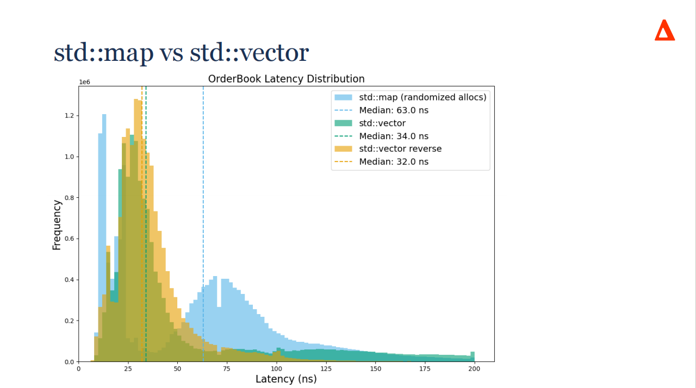
  
<i>Figure 14: Latency distribution after optimizing `std::vector` with a reversed order, showing a much tighter and faster performance.</i>

This leads directly to a crucial principle in ultrafast system design: **Principle 2: Context Matters (Specific Problem, Specific Solution)**. Understanding the specific access patterns and characteristics of the data (like the L-shaped distribution of price updates) is paramount to designing truly optimized data structures. Without this context, generic solutions, even those with theoretically better algorithmic complexity, will fall short.

## V. Principles for Building Ultrafast Systems

David Gross articulates several core principles that guide the development of ultrafast trading systems. These principles emphasize a hardware-aware approach, a deep understanding of system mechanics, and a relentless pursuit of simplicity and efficiency.

### Principle 1: Avoid Node-Based Containers

  
  
<i>Figure 15: Visual representation of scattered data in node-based containers, which leads to performance issues.</i>

This principle is a direct consequence of the performance analysis of `std::map` and its inherent limitations. Node-based containers, such as `std::map`, `std::set`, `std::unordered_map`, `std::unordered_set`, and `std::list`, store their elements in fragmented memory locations. When a new element is inserted, the container typically allocates a small, independent chunk of memory (a "node") and uses pointers to link it to other nodes.

#### Why Node-Based Containers are Detrimental to Ultrafast Systems:

1.  **Cache Misses (The Primary Killer):** The most significant performance penalty comes from cache misses. Modern CPUs operate significantly faster than main memory. To bridge this gap, CPUs use multiple levels of cache. When data is stored contiguously (like in `std::vector`), the CPU can load a block of data into its cache, anticipating future access. With node-based containers, data elements are scattered. Accessing one element often requires following a pointer to a completely different memory location, leading to a cache miss. This forces the CPU to fetch data from slower main memory, drastically increasing latency.

2.  **Memory Allocation Overhead:** Each insertion into a node-based container typically involves a dynamic memory allocation call (e.g., `new`). In high-frequency trading, these system calls are prohibitively slow and contribute to memory fragmentation over time. Frequent allocations and deallocations can also lead to unpredictable pauses due to garbage collection or memory management overhead.

3.  **Pointer Overhead:** On 64-bit systems, a pointer occupies 8 bytes. If the actual data stored in a node is small (e.g., a 4-byte integer), the overhead of storing pointers can be substantial, consuming valuable cache lines with metadata rather than actual data. This further exacerbates cache inefficiency.

To mitigate these issues, HFT systems often replace node-based containers with alternatives that prioritize contiguous memory and controlled memory management:

*   **`std::vector` (Pre-allocated):** By pre-allocating sufficient capacity, `std::vector` can avoid frequent reallocations and ensure data contiguity.
*   **Flat Map / Flat Set:** These are custom data structures that use contiguous arrays to simulate the behavior of maps or sets, often leveraging binary search on sorted arrays.
*   **Object Pools:** A technique where a large block of memory is allocated once, and individual objects are then managed within this pool, avoiding dynamic memory allocations during runtime.

Gross references Adobe Photoshop, noting that 90% of their operations use `std::vector` not because of simplicity, but due to its undeniable performance advantages. This underscores the importance of choosing data structures that align with hardware realities, even if it means sacrificing some algorithmic elegance or convenience.

  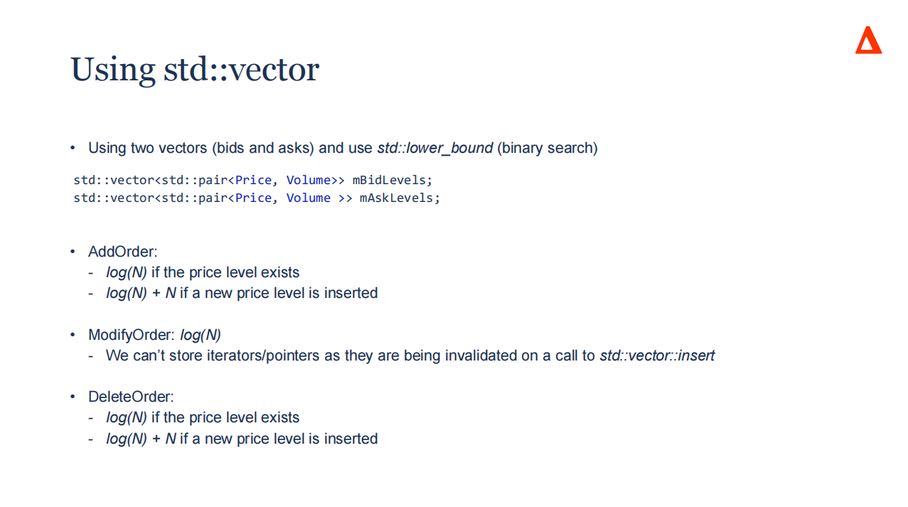
  
<i>Figure 16: Emphasizing the use of `std::vector` for performance-critical applications.</i>

### Principle 2: Context Matters (Specific Problem, Specific Solution)

  
  
<i>Figure 17: Illustrating the importance of understanding the specific context of a problem.</i>

This principle, implicitly demonstrated by the `std::vector` optimization for order books, highlights that generic solutions, however theoretically sound, may not be optimal for highly specialized, performance-critical domains. A deep understanding of the specific problem, including the characteristics of the data, access patterns, and hardware constraints, is paramount. Without this context, one risks implementing solutions that are inefficient or even counterproductive.

### Principle 3: Hand-Tailored (Specialized) Solutions

  
  
<i>Figure 18: The dichotomy between pragmatic engineering and theoretical abstraction, advocating for a practical, specialized approach.</i>

Building upon Principle 2, this principle advocates for developing custom, specialized solutions that exploit the unique properties of the problem at hand. While standard library components offer convenience and robustness, achieving nanosecond-level performance often requires going beyond them. This involves crafting data structures and algorithms that are precisely tuned to the specific workload and hardware, leveraging every available optimization opportunity. Gross contrasts the "pragmatic engineer" (left) with the "abstract thinker" (right), emphasizing the need for a hands-on, problem-solving approach in HFT.

### Principle 4: Simplicity

  
  
<i>Figure 19: The elegance and efficiency inherent in simple, yet powerful, solutions.</i>

Counter-intuitively, achieving extreme performance often involves simplifying, rather than complicating, solutions. Gross posits that an engineer knows their work is done when an algorithm is both fast and exceedingly simple. Simple algorithms are easier to reason about, less prone to subtle bugs, and often expose opportunities for deeper hardware-level optimizations. The linear search, despite its `O(N)` complexity, can outperform more complex algorithms in specific contexts due to its inherent simplicity and cache-friendly access patterns.

### Principle 5: Mechanical Sympathy

  
  
<i>Figure 20: The concept of mechanical sympathy, aligning software design with hardware capabilities.</i>

Coined by Martin Thompson, "Mechanical Sympathy" refers to the practice of designing software with a deep understanding of the underlying hardware architecture. This means writing code that cooperates with the CPU, memory hierarchy, and other components, rather than fighting against them. For instance, designing algorithms that maximize cache hits, minimize branch mispredictions, and avoid false sharing are all manifestations of mechanical sympathy. The linear search, when applied appropriately, is a prime example of an algorithm that exhibits strong mechanical sympathy due to its sequential memory access.

### Principle 6: Efficiency Through Simplification

  
  
<i>Figure 21: A visual metaphor for bypassing unnecessary complexity, such as the Linux kernel, for direct efficiency.</i>

Similar to Principle 4, this principle emphasizes that true efficiency often comes from removing unnecessary layers of abstraction or complexity. In the context of HFT, this frequently means bypassing operating system kernels for network communication or inter-process communication, as the kernel, while robust, introduces overhead that is unacceptable at nanosecond scales. The goal is to streamline the data path, ensuring that only essential operations are performed.

### Principle 7: Choose the Right Tool for the Right Job

  
  
<i>Figure 22: Highlighting the importance of selecting appropriate tools and techniques for specific tasks.</i>

This principle advocates for a pragmatic approach to tool and technology selection. It acknowledges that no single solution is universally optimal. Instead, the choice of data structures, algorithms, and communication mechanisms should be dictated by the specific requirements and constraints of the task. For instance, while `std::map` might be suitable for general-purpose applications, it is not the "right tool" for an ultrafast order book. This principle extends to concurrency models, networking libraries, and profiling tools.

### Principle 8: Sustaining Speed is Harder Than Achieving It

  
  
<i>Figure 23: A reminder that maintaining high performance over time is a continuous challenge.</i>

Achieving a low-latency benchmark in a controlled environment is one thing; maintaining that performance consistently in a dynamic, production trading system is another. This principle underscores the ongoing effort required for monitoring, auditing, and alerting. Even after initial latency bottlenecks are resolved, continuous measurement and vigilance are necessary to detect performance regressions, anticipate new bottlenecks, and ensure the system remains robust and fast over its operational lifetime. The "boring" work of setting up comprehensive telemetry and alerts is crucial for long-term success.

### Principle 9: You Are Not Alone (System-Wide Optimization)

  
  
<i>Figure 24: Emphasizing the interconnectedness of components within a system and the need for holistic optimization.</i>

This principle broadens the scope of optimization beyond a single application or component to the entire server and its ecosystem. Performance is not just about how fast *your* code runs, but how fast *all* code on the server runs collectively. Factors like CPU cache contention, shared memory bandwidth, and the cumulative impact of multiple processes can significantly affect overall system throughput and latency. Gross illustrates this with an experiment showing how multiple worker processes, even when not explicitly sharing data, can impact each other's performance due to shared hardware resources like L3 cache. True optimization requires a holistic view, considering the interactions and resource consumption of all applications running on a given machine.

  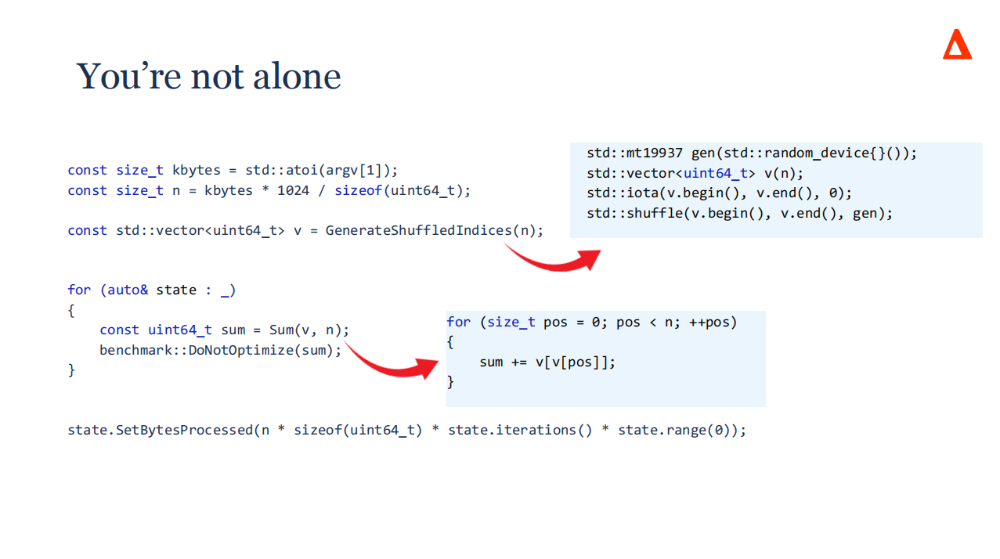
  
<i>Figure 25: An illustration of how multiple processes can contend for shared resources like CPU caches.</i>

  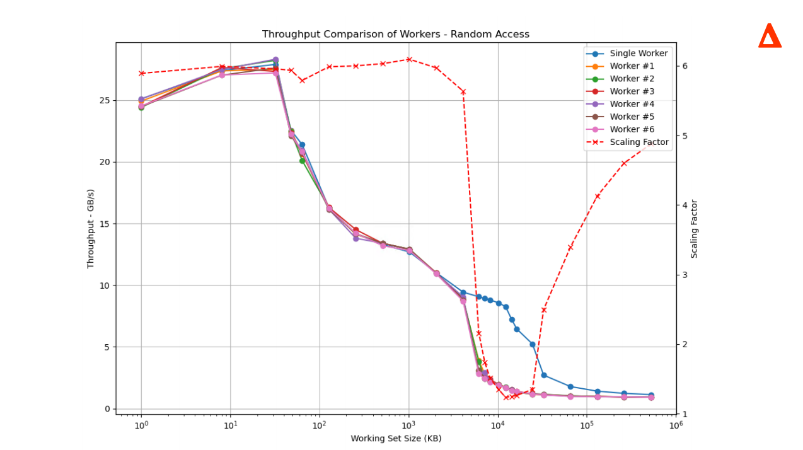
  
<i>Figure 26: Graph showing the impact of multiple worker processes on throughput, highlighting the effects of shared L3 cache.</i>

### Principle 10: Empathy (Considering the Entire System)

  
  
<i>Figure 27: The final principle, advocating for a considerate and holistic approach to system design and optimization.</i>

Building on Principle 9, empathy in this context means considering the impact of your code not just on its own performance, but on the performance of the entire system and the work of your colleagues. It's about understanding that all components share the same underlying hardware. This holistic perspective encourages collaborative optimization and a design philosophy that prioritizes overall system health and efficiency over isolated gains. Ultimately, simple, well-understood systems are not only faster but also easier to maintain and evolve.

## VI. Advanced Performance Measurement and Profiling Techniques

In the pursuit of nanosecond-level latency, intuition alone is insufficient. Rigorous, scientific measurement is paramount to identify bottlenecks, validate optimizations, and understand the true behavior of a system. David Gross emphasizes that if you care about performance, you **must measure** it.

### The Importance of Scientific Measurement

Many engineers, in their eagerness, often measure "everything" without truly measuring "anything." Gross warns against this, advocating for a structured and scientific approach to performance analysis. The goal is to move beyond mere intuition, which is often misleading, and instead rely on empirical data.

### `perf` and Top-Down Micro-architectural Analysis (Intel's Categories)

For deep insights into CPU performance, Gross recommends using Linux `perf` with a top-down micro-architectural analysis methodology, specifically Intel's four categories. These categories provide a comprehensive and largely non-overlapping view of where CPU cycles are being spent, ensuring that no aspect of CPU operation is missed.

  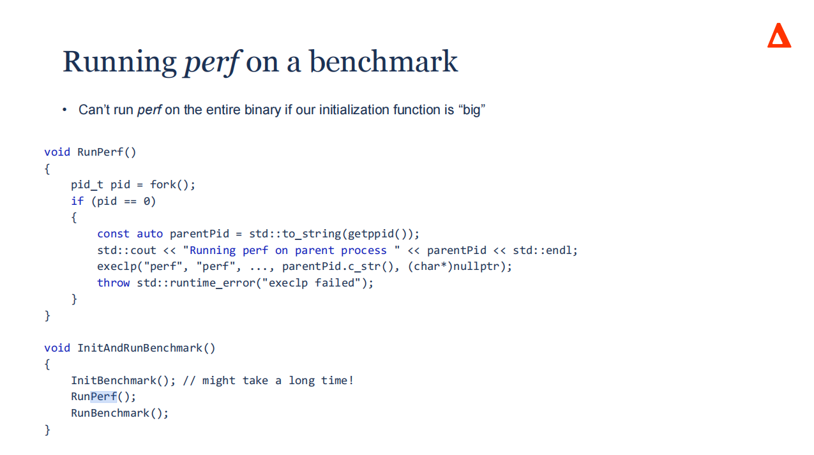
  
<i>Figure 28: Initial `perf` output, highlighting the need for structured analysis.</i>

  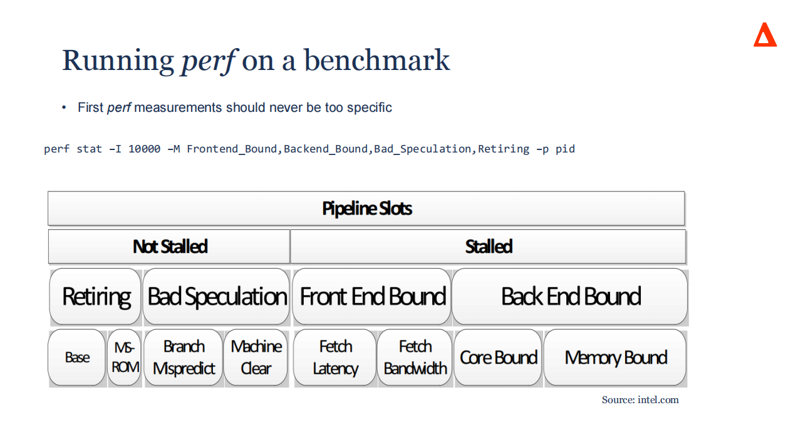
  
<i>Figure 29: The four top-down micro-architectural analysis categories from Intel.</i>

The four categories are:

1.  **Instruction Retire:** Measures the percentage of cycles where instructions are successfully retired (completed). In an ideal scenario, this would be 100%. A low retire rate indicates that the CPU is not effectively executing instructions.
2.  **Bad Speculation:** Accounts for cycles lost due to incorrect speculative execution, primarily caused by branch mispredictions. When the CPU incorrectly predicts the outcome of a branch, it has to discard work and restart, incurring a significant performance penalty.
3.  **Front-End Bound:** Identifies bottlenecks in the instruction fetch and decode stages. This means the CPU's execution units are starving for instructions, often due to issues like instruction cache misses or complex instruction decoding.
4.  **Back-End Bound:** Points to bottlenecks in the execution units or memory access. This occurs when the CPU has instructions ready but cannot execute them due to resource limitations (e.g., waiting for data from memory, execution unit contention).

By analyzing these metrics, engineers can quickly pinpoint the root cause of performance issues. For instance, a high "Bad Speculation" percentage often indicates frequent branch mispredictions, which can be a significant problem in algorithms like binary search, especially when dealing with unpredictable data like market updates.

  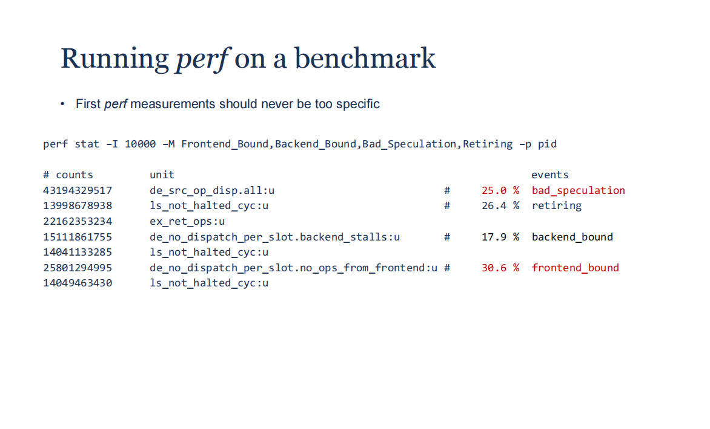
  
<i>Figure 30: Example `perf` output showing a high percentage of bad speculation.</i>

### Identifying Hotspots with Sampling Profilers

While `perf` provides a high-level overview, sampling profilers (like `perf record`) can identify specific code regions (hotspots) consuming the most CPU time. Gross demonstrates this by profiling an `std::lower_bound` implementation, revealing that over 30% of CPU time was spent on conditional jumps within the binary search. This is a classic example of branch misprediction overhead, as market data is inherently unpredictable, making branch prediction difficult for the CPU.

  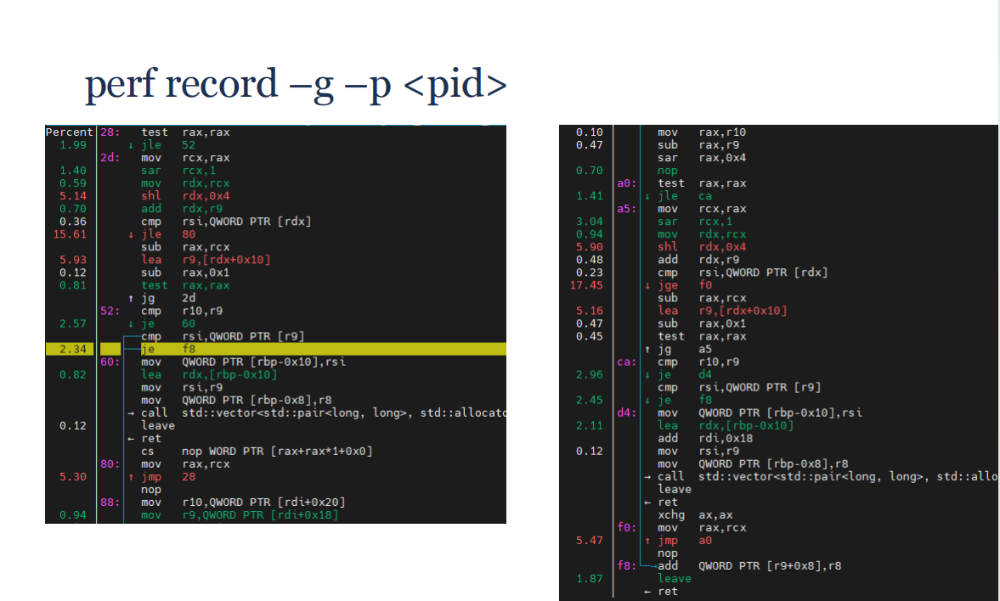
  
<i>Figure 31: Sampling profiler output indicating conditional jumps as a major hotspot.</i>

#### Branchless Binary Search as an Optimization Example

To mitigate branch misprediction penalties, a **branchless binary search** can be employed. This technique refactors the conditional logic to avoid explicit branches, instead using arithmetic operations and bit manipulation. While a branchless approach might access more memory (potentially leading to more cache accesses), it eliminates the costly branch mispredictions, often resulting in a net performance gain for unpredictable data patterns.

  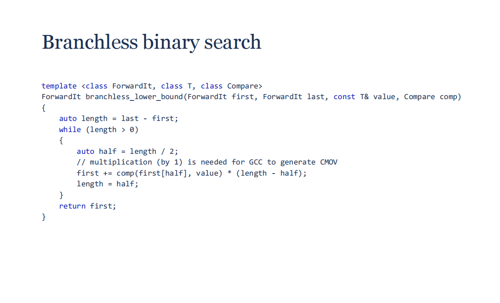
  
<i>Figure 32: Example code for a branchless binary search.</i>

  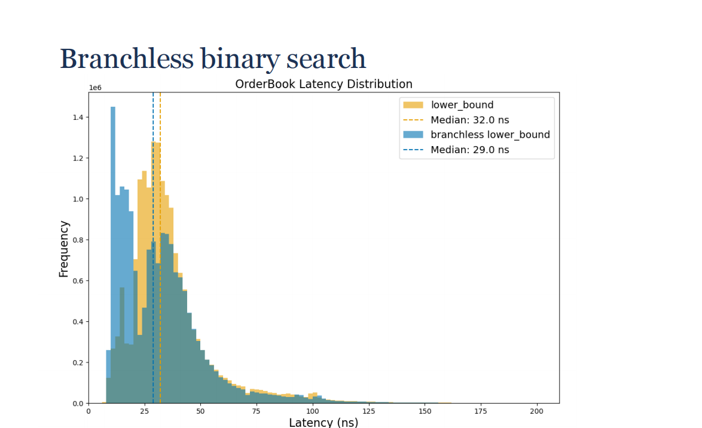
  
<i>Figure 33: Latency distribution for a branchless binary search, showing a narrower profile.</i>

### Hardware Counters with `libpapi` for Granular Insights

For even finer-grained analysis, hardware performance counters can be accessed programmatically using libraries like `libpapi`. These counters provide direct access to CPU events (e.g., cache misses, branch mispredictions, instructions per cycle (IPC)) with minimal overhead. By integrating `libpapi` into benchmarks, engineers can precisely quantify the impact of optimizations. For instance, the branchless binary search example showed a significant reduction in branch mispredictions and an improvement in IPC from 1.4 to 1.57.

  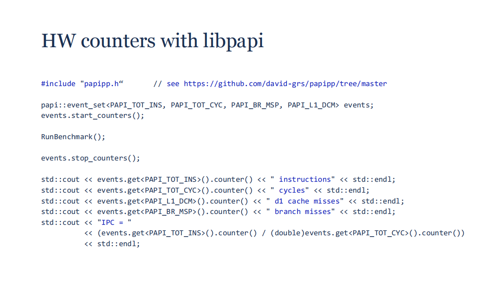
  
<i>Figure 34: Integrating `libpapi` to access hardware counters for precise performance measurement.</i>

  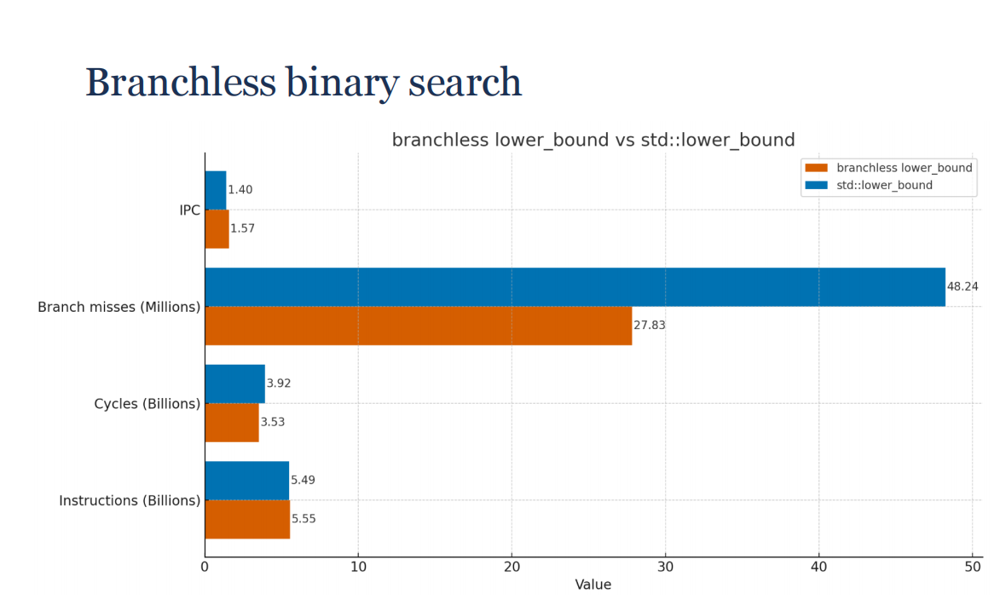
  
<i>Figure 35: Performance improvement demonstrated by hardware counters after implementing branchless binary search.</i>

Ultimately, the fastest solution for searching in a small, contiguous, and frequently updated array can often be a simple **linear search**. This seemingly counter-intuitive approach leverages mechanical sympathy, as its sequential memory access patterns are highly cache-friendly, leading to extremely low and consistent latency with no "fat tail".

  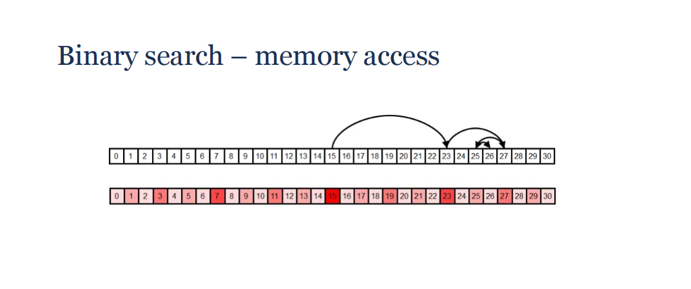
  
<i>Figure 36: Illustrating memory access patterns in binary search.</i>

  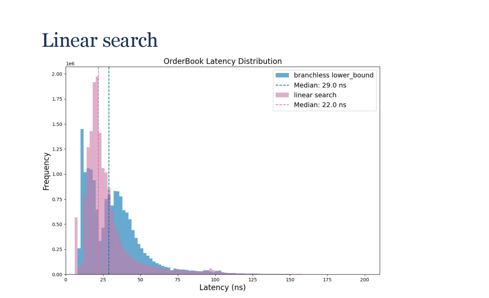
  
<i>Figure 37: Latency distribution for a linear search, demonstrating extremely low and consistent performance.</i>

### I-Cache Misses and Code Layout (IIFE, `std::function` vs. Lambdas)

Beyond data cache performance, **instruction cache (I-Cache) misses** can also significantly impact latency. The I-Cache stores recently executed instructions. If the CPU frequently jumps to different, distant parts of the codebase, it can incur I-Cache misses, leading to stalls. This highlights the importance of code layout and avoiding unnecessary instruction fetches.

  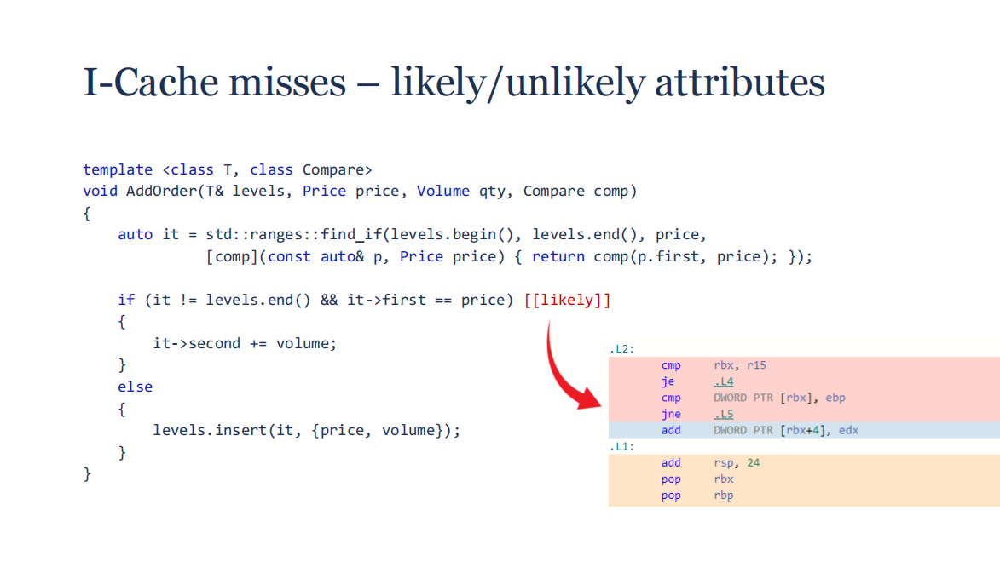
  
<i>Figure 38: The impact of instruction cache misses on performance.</i>

Gross discusses several factors related to I-Cache performance:

*   **Compiler Optimizations:** Compilers might reorder instructions in unexpected ways. For example, an `add` instruction within a conditional branch might be moved to the end of the function if the compiler assumes the branch is rarely taken. However, if that branch is frequently executed ("hot"), this reordering can be detrimental. Engineers need to understand and sometimes guide the compiler to ensure optimal code layout for hot paths.
*   **Inlining:** While inlining functions can reduce call overhead, excessive inlining can bloat code size, potentially leading to more I-Cache misses if frequently used code paths are spread out. Conversely, not inlining critical functions can also introduce performance penalties.
*   **Immediately Invoked Function Expressions (IIFEs):** A technique to isolate "cold" code (e.g., error handling, logging) from "hot" code paths. By wrapping cold code in an IIFE and preventing its inlining, it can be placed in a separate, less frequently accessed part of the binary, thus preserving the I-Cache for critical, performance-sensitive instructions.

  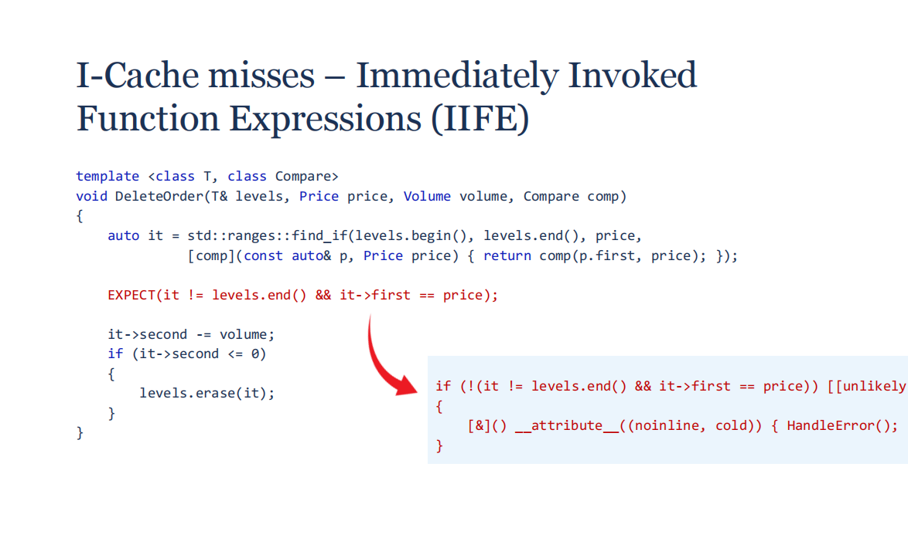
  
<i>Figure 39: Using IIFEs to isolate cold code and improve I-Cache locality.</i>

  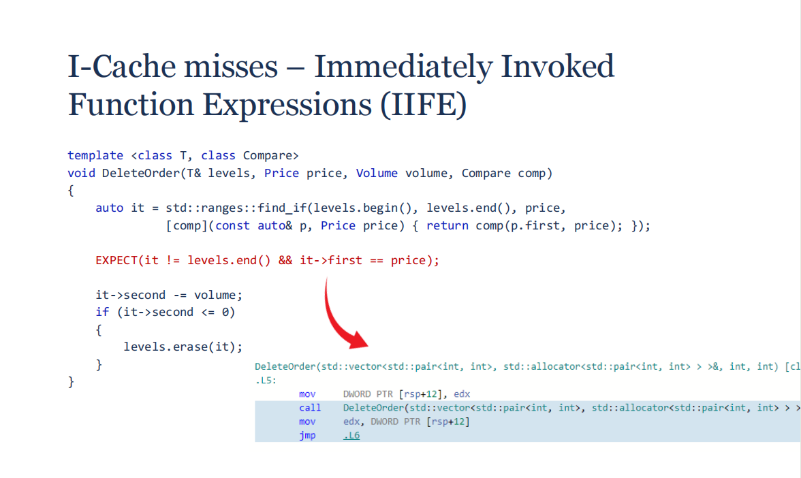
  
<i>Figure 40: The resulting assembly after applying IIFE for better code layout.</i>

*   **Lambdas vs. `std::function`:** Lambdas are powerful because the compiler knows their exact type, enabling aggressive optimizations. `std::function`, however, uses type erasure, which can lead to significant performance overhead due to virtual function calls and loss of type information. For performance-critical code, preferring lambdas over `std::function` (especially when passed as parameters) can yield substantial gains.

  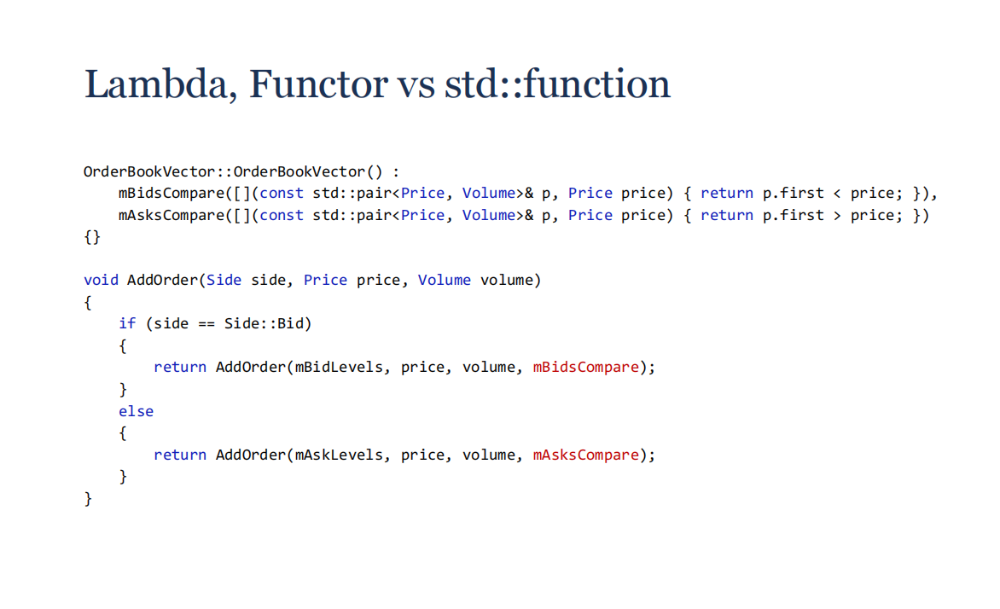
  
<i>Figure 41: A comparison highlighting the performance implications of lambdas versus `std::function`.</i>

## VII. Networking and Concurrency in Ultrafast Systems

Once data structures are optimized for speed, the next frontier in ultrafast trading systems is efficient networking and inter-process communication. Traditional operating system network stacks introduce unacceptable latency for nanosecond-scale operations. Therefore, HFT systems employ specialized techniques to bypass these bottlenecks.

### Kernel Bypass for Low-Latency Transport

  
  
<i>Figure 42: The critical role of networking and concurrency in ultrafast systems.</i>

To achieve the lowest possible latency for network communication, ultrafast trading systems often implement **kernel bypass** techniques. This involves circumventing the operating system's network stack entirely, allowing applications to directly interact with the Network Interface Card (NIC). This eliminates the overhead associated with context switches, system calls, and kernel processing, significantly reducing latency.

  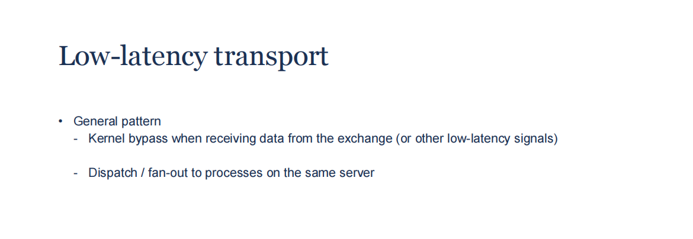
  
<i>Figure 43: Illustrating the concept of kernel bypass for low-latency data transport.</i>

Prominent examples of kernel bypass technologies include:

*   **Solarflare OpenOnload:** A widely used solution that intercepts standard BSD socket calls and redirects them to a user-space network stack, often without requiring application code changes. This provides a significant latency reduction for TCP and UDP traffic.
*   **Intel DPDK (Data Plane Development Kit):** A set of libraries and drivers for fast packet processing in user space. DPDK provides a framework for developing high-performance applications that directly access network devices, offering even lower latency by managing buffers and queues directly.
*   **Layer 2 APIs (e.g., Solarflare EF_VI):** For the absolute lowest latency, applications can interact directly with the NIC hardware at Layer 2 (Ethernet frame level). This requires the application to manage all aspects of packet construction and deconstruction but offers the ultimate control over network latency.

Measurements from AMD Zen4 architecture demonstrate that using Layer 2 APIs can achieve minimum UDP packet latencies as low as 700 nanoseconds for minimal packet sizes, a testament to the effectiveness of kernel bypass.

  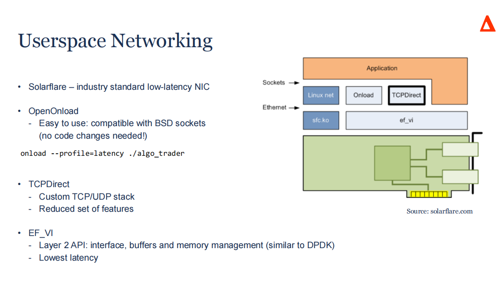
  
<i>Figure 44: A conceptual diagram of userspace networking, bypassing the kernel.</i>

  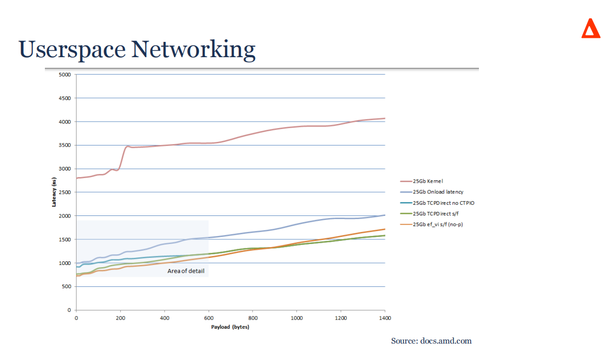
  
<i>Figure 45: Latency measurements for userspace networking, showcasing the performance gains.</i>

### Shared Memory for Inter-Process Communication

When multiple processes or strategies need to access the same data on a single server, traditional inter-process communication (IPC) mechanisms like sockets introduce unnecessary overhead. **Shared memory** emerges as the industry standard for ultra-low-latency IPC in such scenarios. By mapping a region of physical memory into the address space of multiple processes, data can be exchanged without involving the kernel after the initial mapping, effectively reducing data transfer to a simple memory read or write.

  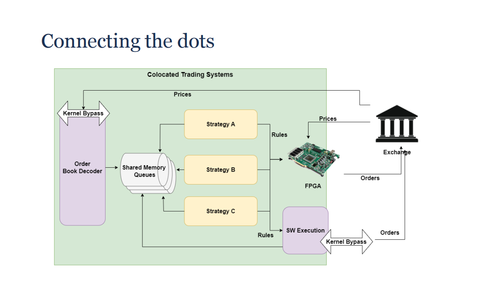
  
<i>Figure 46: Integrating kernel bypass and shared memory within a trading system architecture.</i>

Key advantages and considerations for shared memory:

*   **Speed:** Data transfer occurs at memory speeds, which are orders of magnitude faster than network or traditional IPC mechanisms.
*   **No Kernel Involvement (Post-Mapping):** After the initial setup, the kernel is largely bypassed for data access, aligning with Principle 6: Efficiency Through Simplification.
*   **Operational Benefits (Multi-Process Architecture):** While shared memory allows for direct data sharing, a multi-process architecture (where each strategy runs in its own process) offers significant operational advantages. It promotes **separation of concerns**, preventing a crash in one strategy from bringing down the entire system. This is crucial for resilience and stability in production environments.
*   **Contiguous Memory:** Shared memory often works best with contiguous data structures, further leveraging cache locality.
*   **Protocol Versioning and Magic Numbers:** When using shared memory, it is critical to implement robust protocol versioning (major and minor versions) and "magic numbers" in the shared memory header. This prevents misinterpretation of data if an application accidentally opens the wrong shared memory segment or if the protocol evolves over time.

  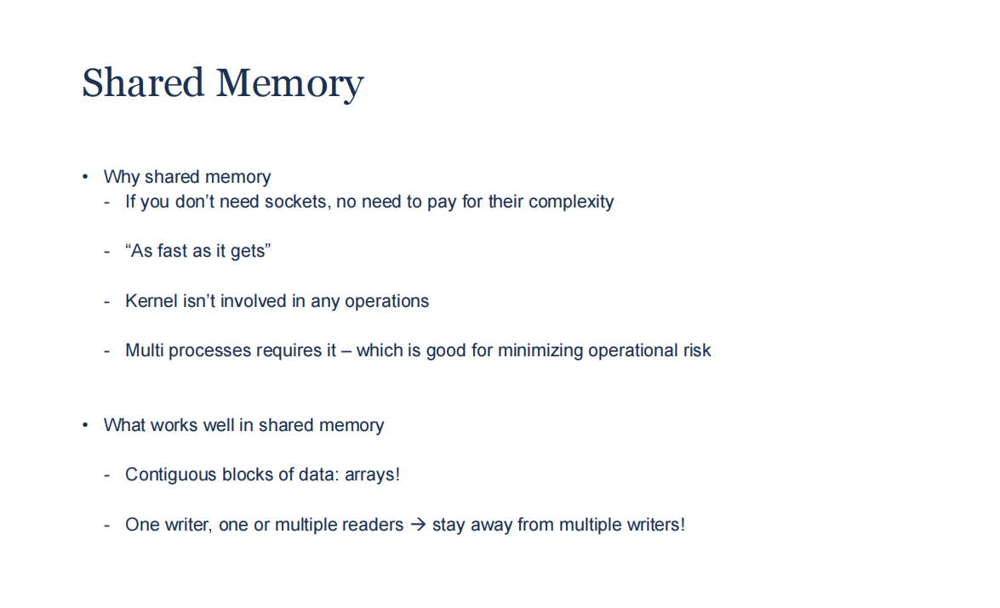
  
<i>Figure 47: A conceptual diagram of shared memory usage.</i>

  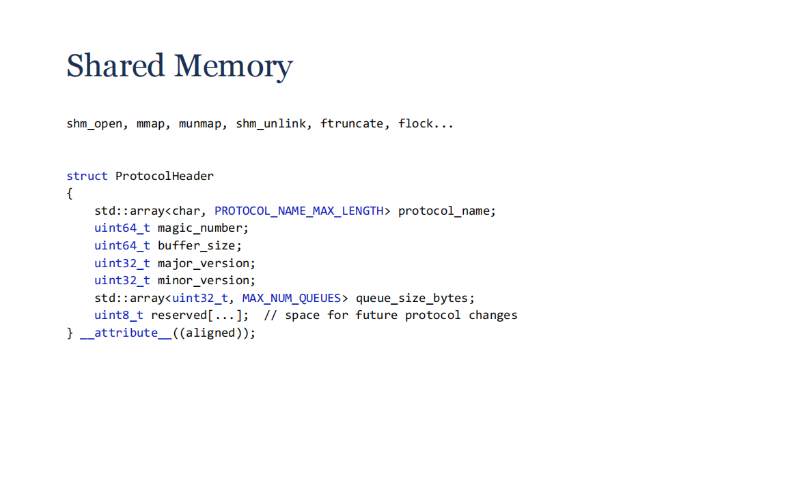
  
<i>Figure 48: Example of a shared memory header with protocol details.</i>

### Concurrent Queues: Bounded, Non-Blocking, Variable-Length Messages

Within a multi-process or multi-threaded HFT system, concurrent queues are essential for safely and efficiently passing messages between different components. Gross focuses on the design of a specialized concurrent queue with the following characteristics.

*   **Bounded:** The queue has a fixed, pre-determined size, avoiding dynamic resizing overheads.
*   **Non-Blocking:** Crucially, the queue should not block producers if consumers are slow. In a system with many strategies, a slow consumer should not impede the entire system. This is vital for maintaining overall system throughput and preventing cascading failures.
*   **Variable-Length Messages:** The queue should support messages of varying sizes, allowing for flexible data payloads rather than just pointers. Copying data directly into the queue is often faster and safer than passing pointers, which can lead to issues like heap fragmentation or complex memory management across processes.
*   **Multiple Consumers (Fan-out):** The design supports multiple consumers reading the same messages, enabling a fan-out pattern where all interested strategies receive a copy of the data (e.g., market data updates). This is distinct from a load-balancing queue where messages are distributed among consumers.

  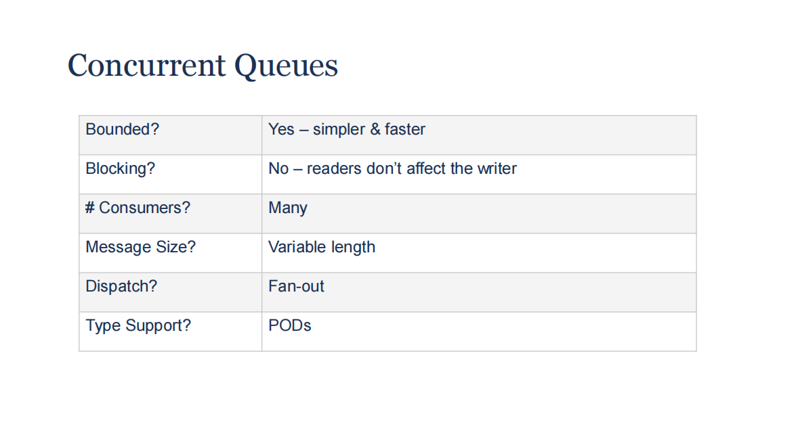
  
<i>Figure 49: The architecture of a concurrent queue designed for HFT.</i>

## VIII. Designing and Optimizing Concurrent Queues

The design of a high-performance concurrent queue is critical for inter-component communication in ultrafast systems. Gross details a specific design that prioritizes speed and non-blocking behavior.

### Core Design: Producer/Consumer Counters

The queue design relies on two atomic counters: a **write counter** (or right counter) and a **read counter** (or left counter). Both are modified by the producer, but only read by consumers. The producer increments the write counter to reserve space, copies data, and then increments the read counter to make the data visible to consumers. Consumers only read these counters and do not modify them.

  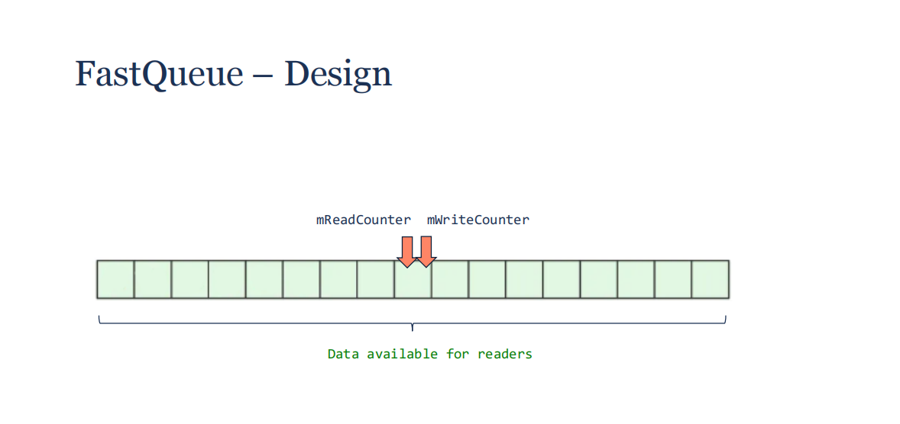
  
<i>Figure 50: Initial state of the concurrent queue with producer/consumer counters.</i>

  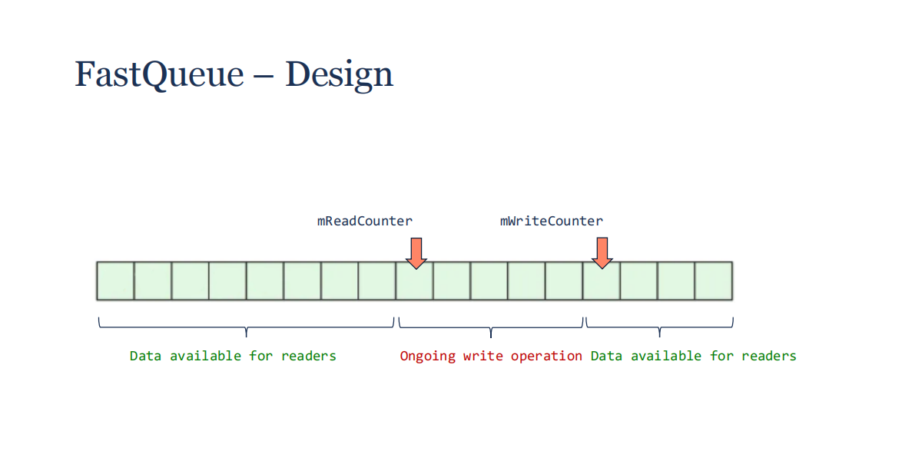
  
<i>Figure 51: Producer increments the right counter to reserve space.</i>

  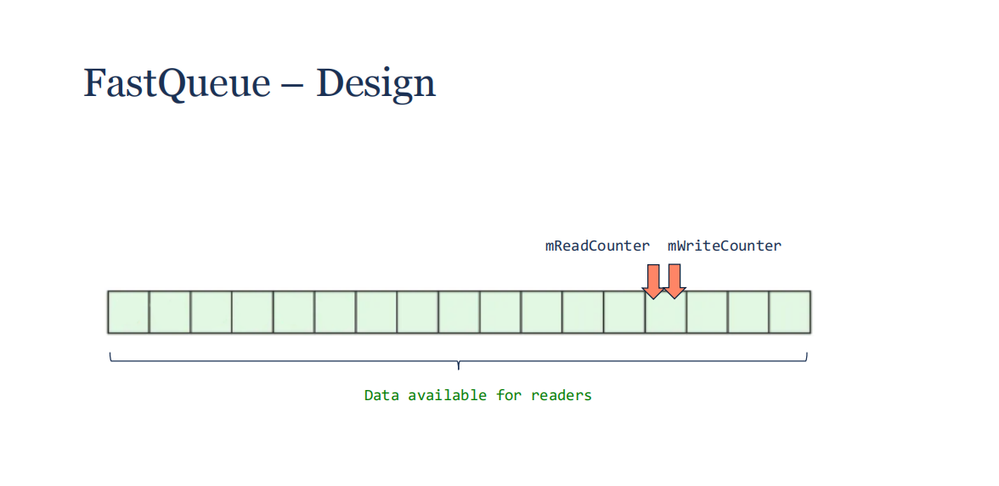
  
<i>Figure 52: Producer copies data and then increments the read counter.</i>

  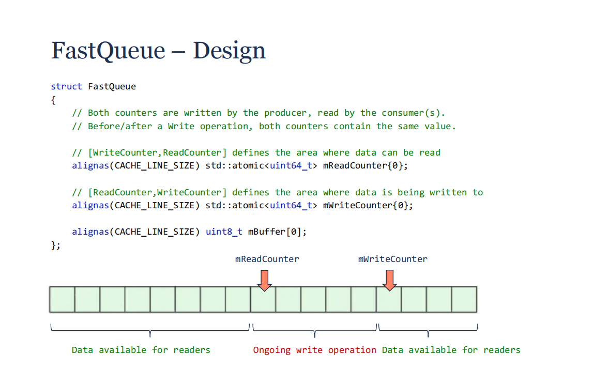
  
<i>Figure 53: The queue head showing the two atomic counters.</i>

#### Atomic Operations and Pseudo-Sharing

The counters are typically `u64` atomic variables. A critical consideration is **false sharing**, where unrelated atomic variables residing on the same cache line can cause performance degradation due to cache coherence protocols. Proper padding of these counters is essential to ensure they reside on separate cache lines, preventing false sharing.

The API for such a queue is relatively simple, involving `write_bytes` and `read_bytes` functions. The `read_bytes` function requires a buffer to copy data into, as it supports variable-length messages and avoids passing pointers across process boundaries.

  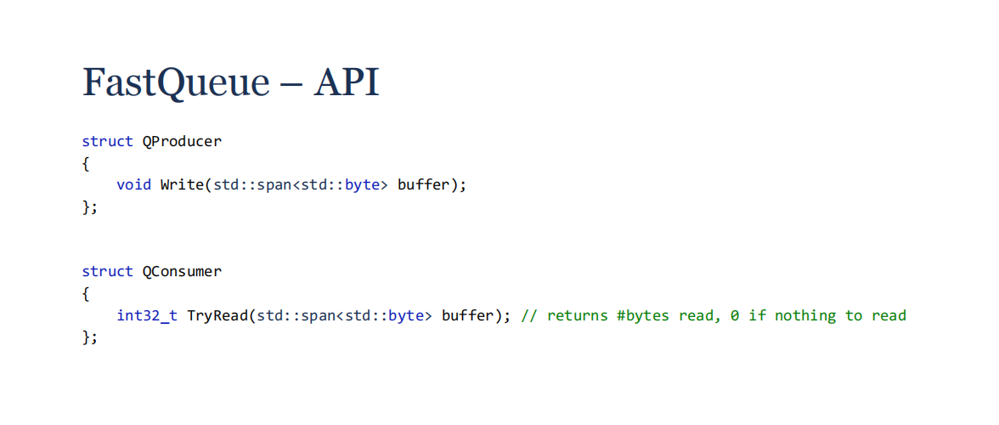
  
<i>Figure 54: The simplified API for the concurrent queue.</i>

  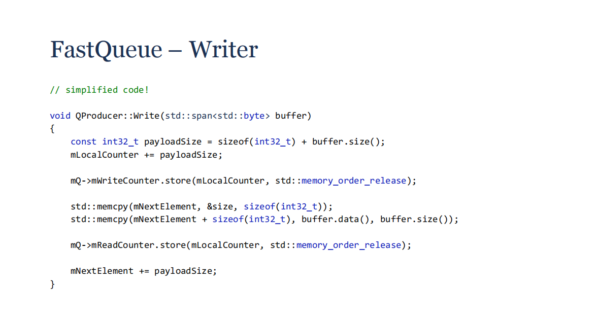
  
<i>Figure 55: Simplified code for the queue writer.</i>

  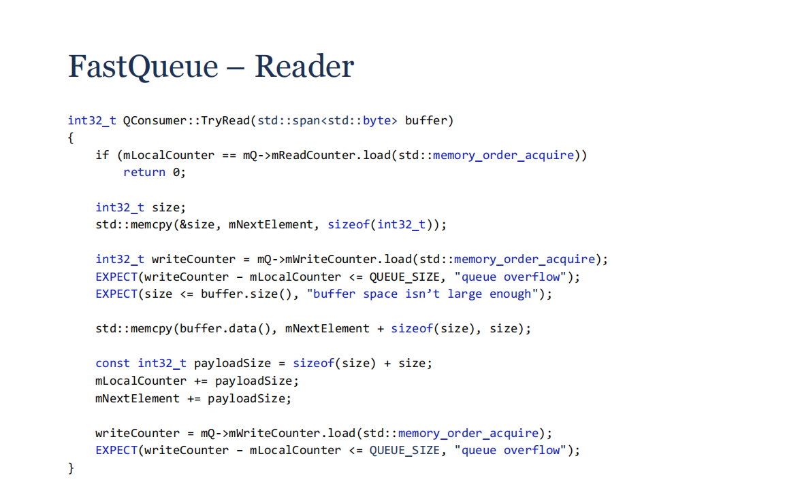
  
<i>Figure 56: Simplified code for the queue reader.</i>

### Performance Benchmarking (vs. Disruptor, Aeron)

Benchmarking against established low-latency IPC libraries like **Disruptor** (a well-known ring buffer implementation) and **Aeron** (a high-performance messaging library used in trading) is crucial. Gross presents baseline performance for his queue design, noting that while good, there are further optimizations to be made.

  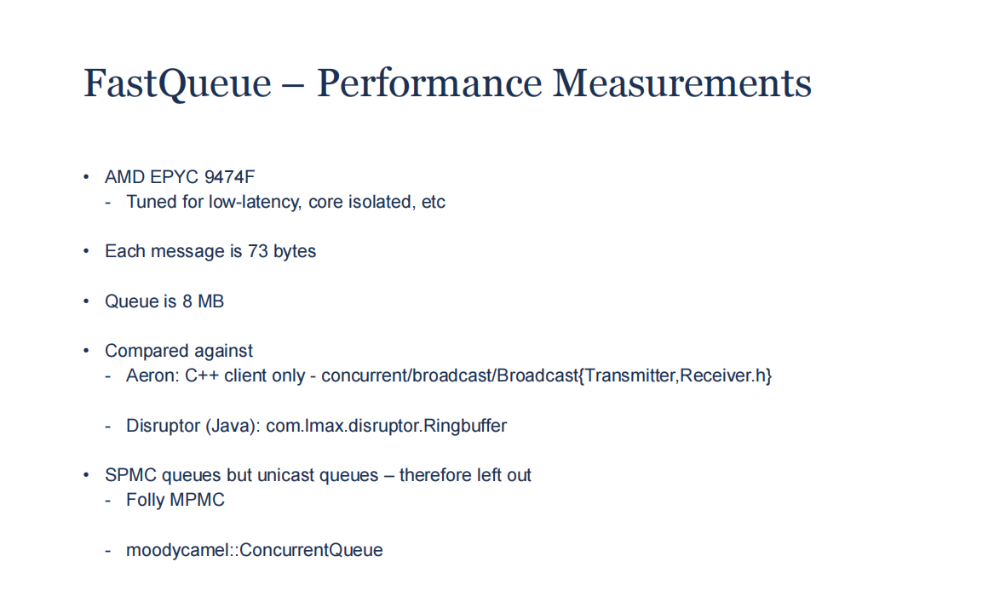
  
<i>Figure 57: Performance measurement setup for the concurrent queue.</i>

  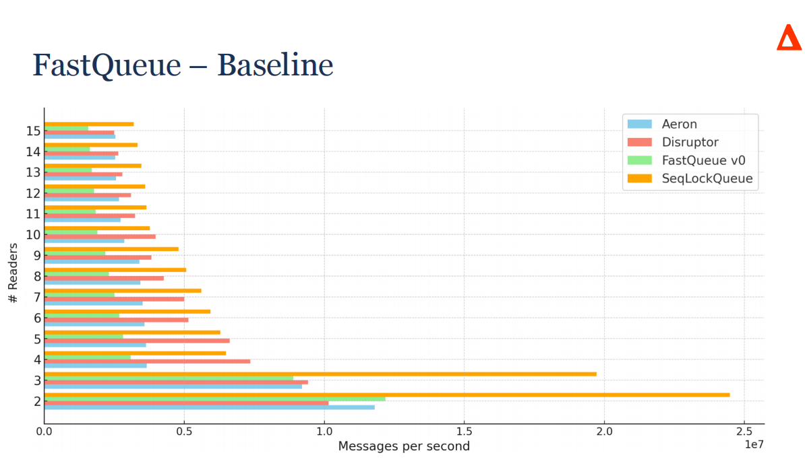
  
<i>Figure 58: Baseline performance of the concurrent queue.</i>

### Key Optimizations

Gross outlines three key optimizations to further enhance the performance of the concurrent queue.

1.  **Batching Atomic Operations (Reserving Space):** Instead of incrementing the write counter for every single message, the producer can reserve a larger block of space (e.g., 100KB). This means the atomic write counter is updated less frequently (e.g., once every thousand messages for 100-byte messages), significantly reducing contention and atomic operation overhead.

    

      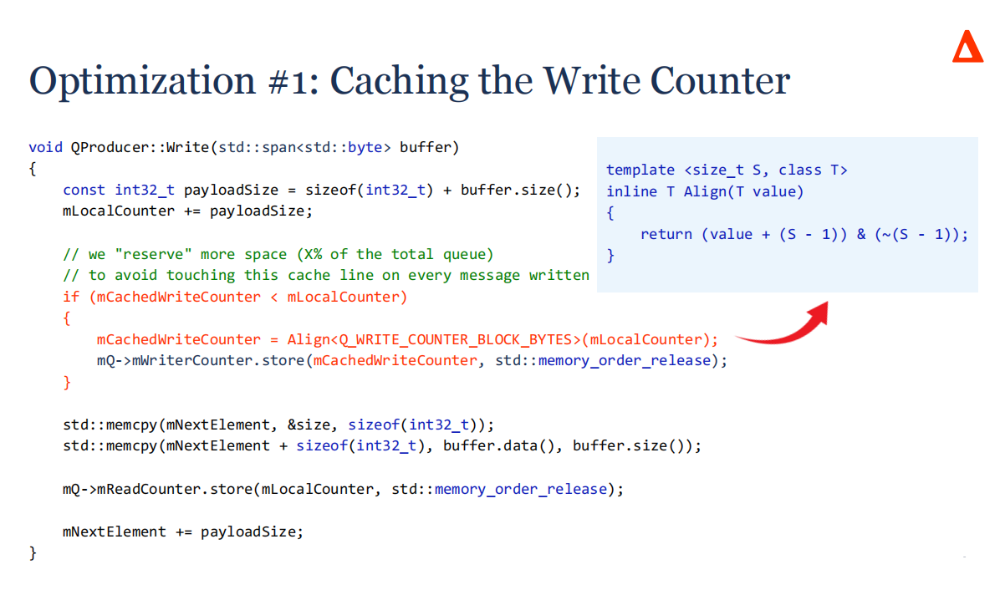
      
<i>Figure 59: Batching atomic operations to reduce contention.</i>

    

2.  **Data Alignment:** While `x86` architectures don't strictly require cache-line alignment for data, aligning data to 8-byte boundaries is generally optimal for performance. Over-aligning to cache line sizes (e.g., 64 bytes) for individual elements can negatively impact cache locality and is often unnecessary.

    

      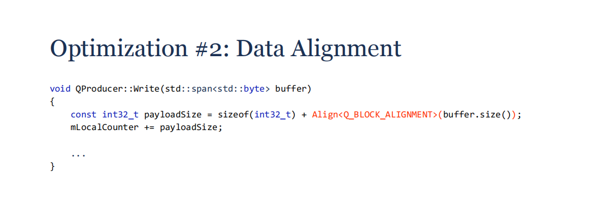
      
<i>Figure 60: Optimizing data alignment for better performance.</i>

    

3.  **Avoiding Redundant Reads:** If a consumer has recently read a large block of data from the queue, it doesn't need to re-read the write counter immediately if it knows there's still unread data within its reserved block. This reduces unnecessary atomic reads.

    

      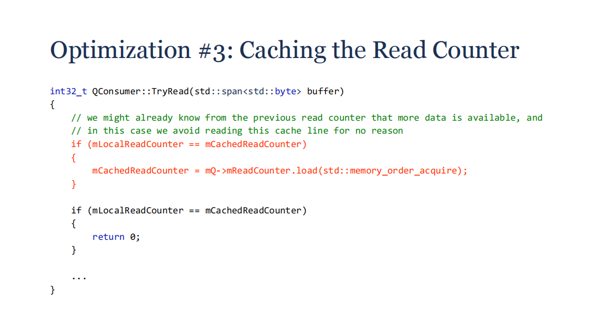
      
<i>Figure 61: Avoiding redundant reads of the write counter.</i>

    

These optimizations, when combined, can significantly improve the queue's performance, resulting in a much tighter and faster latency distribution.

  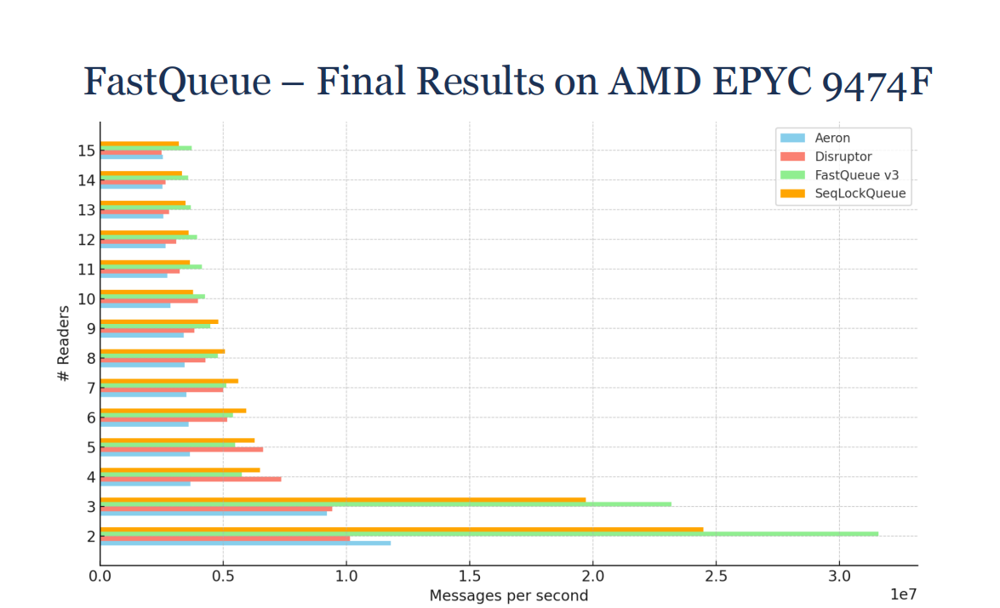
  
<i>Figure 62: Final performance results of the optimized concurrent queue.</i>

## IX. Measuring Event-Driven Systems

Measuring the performance of event-driven, low-latency systems presents unique challenges. Traditional profiling tools, while useful, often fall short in providing the precise, low-overhead insights required for nanosecond-scale analysis.

  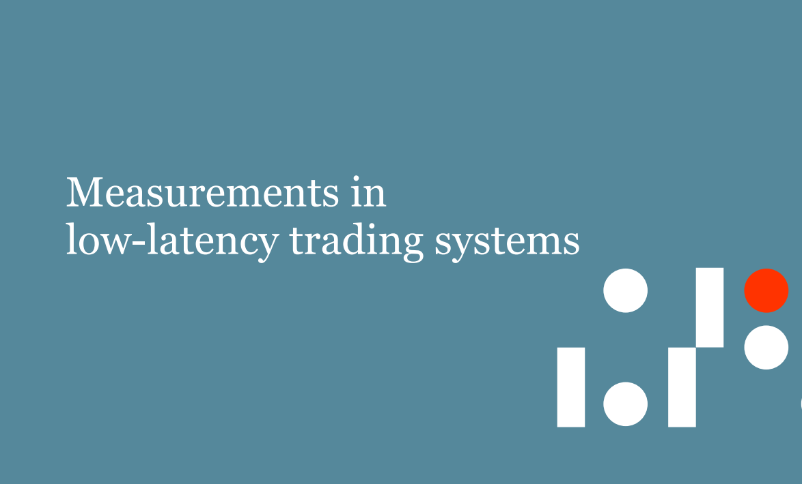
  
<i>Figure 63: The measurement paradigm for low-latency trading systems.</i>

### Challenges of Traditional Profiling for Event-Driven Architectures

Event-driven systems typically feature a main loop that polls for events (e.g., from the NIC), processes them, and potentially sends orders. Standard profiling techniques like `perf` (which samples) or simple counter increments often fail to capture the true latency distribution of individual function calls within such a system. Sampling can miss short-lived events, and counters only provide aggregate data, not per-event latency.

  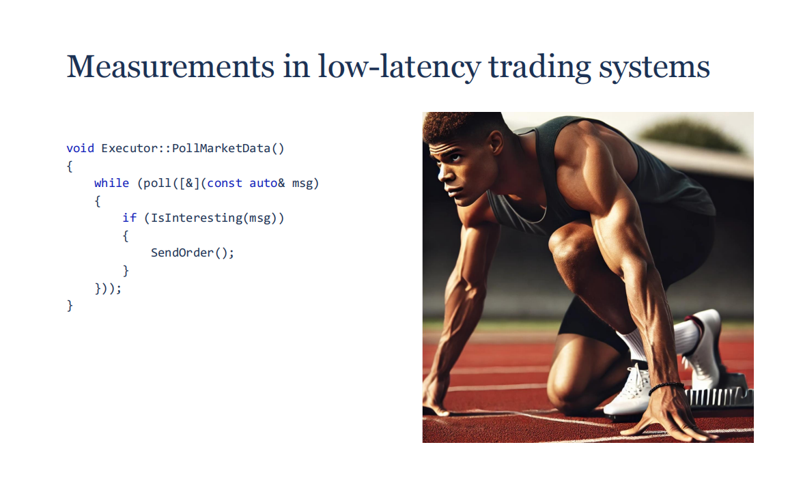
  
<i>Figure 64: A simplified event loop in a trading system.</i>

### Invasive Profiling with TSC (Time Stamp Counter)

For highly accurate, low-overhead measurements, **invasive profiling** using the CPU's **Time Stamp Counter (TSC)** is a common technique. This involves instrumenting the code by adding small objects that read the TSC at the beginning and end of a function or code block. The difference between these two readings provides a precise, nanosecond-resolution measurement of the elapsed time. While effective, this approach requires modifying the codebase, which can be cumbersome and introduce maintenance overhead if not managed carefully.

  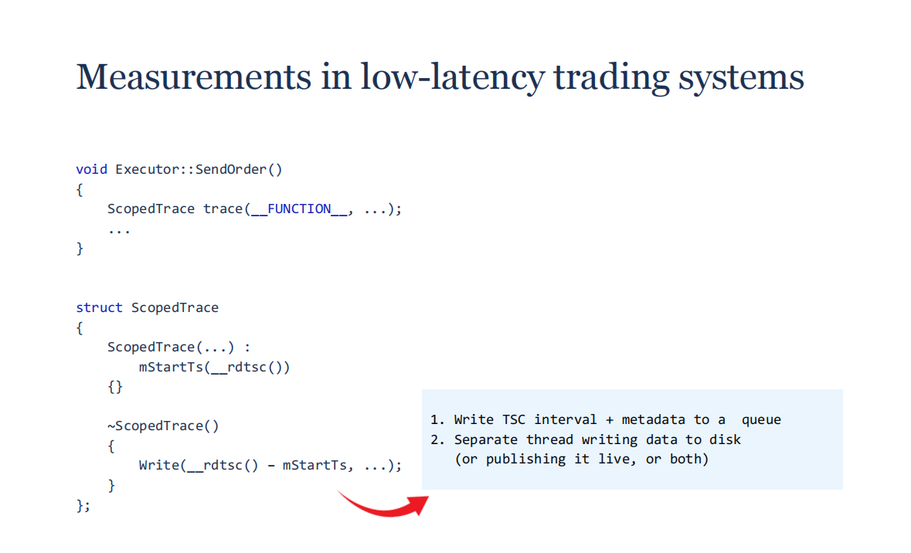
  
<i>Figure 65: Invasive profiling using TSC for precise latency measurement.</i>

### Clang Xray for Production-Ready, Low-Overhead Profiling

To overcome the limitations of invasive profiling and traditional sampling, Gross advocates for **Clang Xray**. Xray is a dynamic tracing system that allows for low-overhead instrumentation of functions at compile time. When compiling with a special flag, Clang inserts hooks (simple, low-cost instructions) at the entry and exit points of functions. In production, these hooks do nothing by default, incurring minimal overhead. However, when profiling is desired, the binary can be dynamically modified (without recompilation) to replace these hooks with more elaborate calls to a tracing library. This provides the best of both worlds: precise, function-level latency measurements with extremely low overhead in production, and a seamless workflow for engineers.

  
  
<i>Figure 66: The challenge of finding bottlenecks in a dynamic system.</i>

  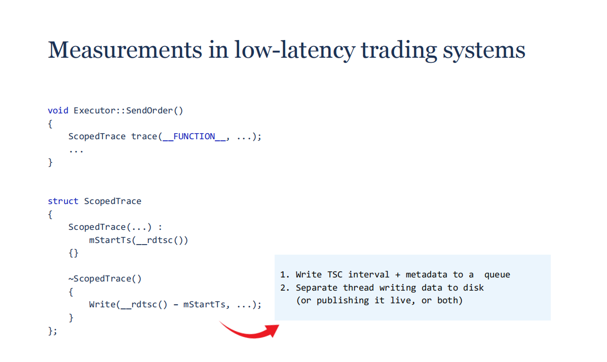
  
<i>Figure 67: The iterative process of identifying and resolving bottlenecks.</i>

  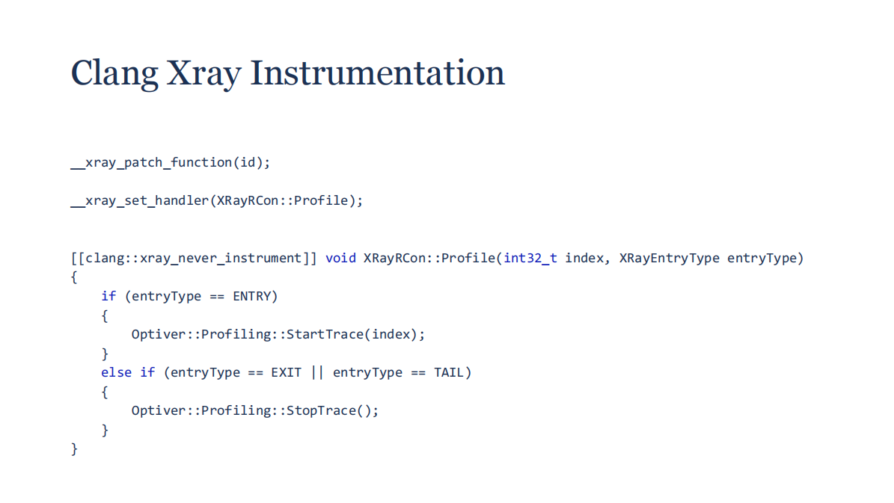
  
<i>Figure 68: Clang Xray for dynamic, low-overhead function tracing.</i>

Beyond just measuring latency, it is crucial to continuously audit and alert on performance metrics. Even if a system achieves satisfactory latency, without ongoing monitoring and auditing, performance regressions can go unnoticed. This reinforces Principle 8: Sustaining Speed is Harder Than Achieving It.

## X. Conclusion: The Philosophy of Ultrafast Engineering

David Gross concludes his presentation by reiterating the overarching philosophy that underpins successful ultrafast engineering. It is a philosophy rooted in discipline, simplicity, and a holistic view of the system.

### Recap: No Silver Bullet, Discipline, Simplicity

  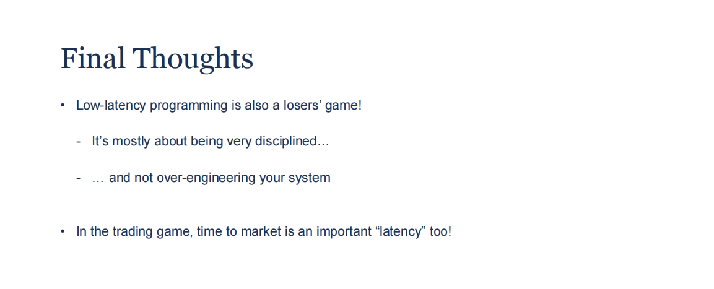
  
<i>Figure 69: Final thoughts on the principles of ultrafast engineering.</i>

Just as market making is a "loser's game" requiring consistent excellence across all facets, so too is low-latency programming. There is no single "silver bullet" or magic solution. Instead, success hinges on a disciplined approach that prioritizes simplicity. Simple systems are not only faster but also easier to understand, maintain, and evolve. This inherent simplicity contributes to a faster "time to market" for new features and optimizations, which is another critical form of latency in the business world.

### The Importance of Time to Market

While the talk primarily focuses on technical latency, Gross subtly introduces the concept of **time to market** as another crucial form of latency. A complex system, even if technically fast, can be slow to adapt to new market conditions or implement new strategies. By keeping systems simple and understandable, teams can deploy changes more rapidly, gaining a competitive edge. This underscores that the principles of simplicity and maintainability are not just about code quality but directly impact business agility and overall success.

## XI. Attribution

*   **Editor:** Peile Wu (Peter Wayne)
*   **Source:** [When Nanoseconds Matter: Ultrafast Trading Systems in C++ - David Gross - CppCon 2024](https://www.youtube.com/watch?v=sX2nF1fW7kI)

## Go further

*   [Trading at light speed: designing low latency systems in c++ - David Gross](https://www.youtube.com/watch?v=8uAw5FQtcvE )
*   [What Every Programmer Should Know About Memory - Ulrich Drepper](https://people.freebsd.org/~lstewart/articles/cpumemory.pdf )
*   [AMD X3 NIC Low Latency Quickstart](https://docs.amd.com/en-us/ug1586-onload-user/X3-Low-Latency-Quickstart )
*   [Optimizing RHEL 9 for Real Time for low latency](https://docs.redhat.com/en/documentation/red_hat_enterprise_linux_for_real_time/9/html/optimizing_rhel_9_for_real_time_for_low_latency_operation/index )
*   [Can seqlocks get along with programming language memory models? - Hans-J. Boehm](https://www.researchgate.net/publication/254006312_Can_seqlocks_get_along_with_programming_language_memory_models )
*   [Unlocking Modern CPU Power - Next-Gen C++ Optimization Techniques - Fedor G Pikus](https://www.youtube.com/watch?v=wGSSUsealGA )
*   [Data-Oriented Design and C++ - Mike Acton](https://www.youtube.com/watch?v=rX0ItVEVJHc )
